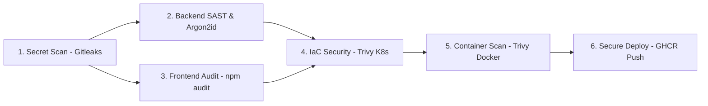

# 🏛️ SIMPL-IS — Plateforme de Télédéclaration et Télépaiement de l'Impôt sur les Sociétés (DGI Maroc)

Bienvenue dans le dépôt du projet **SIMPL-IS**, la solution web sécurisée de télédéclaration et télépaiement de l'Impôt sur les Sociétés (IS) développée selon les meilleures pratiques **DevSecOps** et les normes de la Direction Générale des Impôts (DGI Maroc).

---

## 📌 Sommaire
1. [Présentation du Projet](#-présentation-du-projet)
2. [Architectures et Choix Techniques](#-architectures-et-choix-techniques)
3. [Sécurité et Cryptographie (Argon2id & JWT)](#-sécurité-et-cryptographie-argon2id--jwt)
4. [Pipeline CI/CD DevSecOps "Shift-Left" (GitHub Actions)](#-pipeline-cicd-devsecops-shift-left-github-actions)
5. [Orchestration Docker & Local Dev](#-orchestration-docker--local-dev)
6. [Architecture Kubernetes & Durcissement Sécurité (k8s/)](#-architecture-kubernetes--durcissement-sécurité-k8s)
7. [Prérequis Système](#-prérequis-système)
8. [Guide d'Installation et d'Exécution](#-guide-dinstallation-et-dexécution)
9. [Guide d'Utilisation de l'Application](#-guide-dutilisation-de-lapplication)
10. [Consultation de la Base de Données](#-consultation-de-la-base-de-données)
11. [Tests d'Intégration & Sécurité](#-tests-dintégration--sécurité)

---

## 🇲🇦 Présentation du Projet

L'application **SIMPL-IS** permet aux contribuables et sociétés marocaines d'effectuer l'ensemble de leurs obligations fiscales relatives à l'Impôt sur les Sociétés en ligne :
- **Authentification sécurisée** par Identifiant Fiscal (IF).
- **Auto-inscription et connexion fluide** pour tout contribuable.
- **Saisie dynamique des Produits et des Charges** de l'exercice comptable.
- **Calcul automatique et conforme DGI** du Résultat Comptable, Résultat Fiscal, Cotisation Minimale (0.5%), et du montant de l'Impôt sur les Sociétés (IS) à payer.
- **Dépôt, Validation et Rectification** des déclarations fiscales avec conservation historique.

---

## 🛠️ Architectures et Choix Techniques

### 🔹 Backend (API RESTful)
- **Langage / Framework** : Java 17, Spring Boot 3.4.
- **Sécurité** : Spring Security 6, Token JWT (HMAC-256).
- **Hachage Mot de Passe** : **Argon2id** (Argon2BytesGenerator BouncyCastle).
- **ORM / Persistance** : Spring Data JPA, Hibernate, PostgreSQL 16 / H2 Database.
- **Gestion des Dépendances** : Apache Maven (Wrapper `mvnw`).

### 🔹 Frontend (Single Page Application)
- **Framework** : Angular 21 (TypeScript, RxJS, Angular Material).
- **Style & UI** : SCSS custom aux couleurs et normes graphiques officielles de la DGI Maroc (Bleu Roi, Or, Blanc pur).
- **Serveur Web de Production** : Nginx Alpine hardened (Non-root user `101`).

---

## 🔒 Sécurité et Cryptographie (Argon2id & JWT)

Conformément au cahier des charges DevSecOps et aux recommandations ANRT/DGI :

1. **Algorithme Argon2id** :
   - **Mode** : Argon2id (hybride résistant aux attaques par canal auxiliaire et aux GPU/ASIC).
   - **Paramètres** : 3 itérations, 16 MB de mémoire vive, 4 threads de parallélisme.
   - **Salt (Sel)** : 16 octets aléatoires générés de manière cryptographiquement forte et stockés de façon unique par utilisateur.
   - **Pepper (Poivre)** : Clé secrète côté serveur intégrée avant le hachage.
2. **Protection Anti-Bruteforce** :
   - Compteur de tentatives échouées. Le compte utilisateur est **automatiquement bloqué** après 3 tentatives de mot de passe incorrects.
3. **Jetons JWT (JSON Web Token)** :
   - Signature cryptographique **HMAC-256**.
   - Injection automatique de l'en-tête `Authorization: Bearer <token>`.
   - Expiration automatique et redirection en cas de session expirée (HTTP 401/403).

---

## 🛡️ Pipeline CI/CD DevSecOps "Shift-Left" (GitHub Actions)

Le pipeline GitHub Actions ([.github/workflows/devsecops-ci-cd.yml](file:///.github/workflows/devsecops-ci-cd.yml)) intègre la sécurité à **chaque étape de la chaîne de livraison** (Shift-Left Security) :



### 📋 Détail des 6 Étapes Automatisées :

| Étape | Nom du Job | Outil / Contrôle | Rôle & Action DevSecOps |
| :--- | :--- | :--- | :--- |
| **Étape 1** | `1. Secret Scanning` | **Gitleaks** | Scan de chaque commit pour prévenir la fuite de secrets, clés API ou jetons JWT. |
| **Étape 2** | `2. Backend Security & Unit Tests` | **JUnit 5 / Maven** | Compilation Java 17 et exécution des 21 tests de sécurité (Argon2id, JWT, BruteForce). |
| **Étape 3** | `3. Frontend Audit & Angular Build` | **`npm audit` / Angular CLI** | Audit des vulnérabilités de packages JS (`npm audit`) et compilation sécurisée Angular. |
| **Étape 4** | `4. IaC Security Scan` | **Trivy IaC / Kustomize** | Scan des manifestes Kubernetes (`k8s/`) à la recherche de mauvaises configurations de sécurité. |
| **Étape 5** | `5. Container Image Scan` | **Trivy Container Scan** | Analyse des vulnérabilités OS et bibliothèques sur les images Docker produites. |
| **Étape 6** | `6. Secure Registry Push` | **Docker CLI / GHCR** | Connexion sécurisée et publication des images conteneurisées sur GitHub Container Registry. |

---

## 🐳 Orchestration Docker & Local Dev

Le fichier [docker-compose.yml](file:///docker-compose.yml) permet de lancer l'intégralité de la stack en local en une seule commande :

```yaml
version: '3.8'
services:
  postgres: # PostgreSQL 16 (Port hôte 5433)
  backend:  # Spring Boot API (Port 8080)
  frontend: # Angular / Nginx Web Server (Port 80)
```

- **Sécurité des Conteneurs** :
  - `simplis-backend` s'exécute sous un utilisateur non-root (`UID 10001`).
  - `simplis-frontend` s'exécute sous l'utilisateur Nginx non-root (`UID 101`).

---

## ☸️ Architecture Kubernetes & Durcissement Sécurité (k8s/)

Le dossier [k8s/](file:///k8s/) contient l'infrastructure sous forme de manifestes déclaratifs prêts pour la production :

1. **`00-namespace.yaml`** : Création du Namespace `simpl-is` avec application du standard de sécurité Pod **`pod-security.kubernetes.io/enforce: restricted`**.
2. **`01-postgres-config-secret.yaml`** : Séparation stricte de la configuration (`ConfigMap`) et des secrets cryptographiques (`Secret`).
3. **`02-postgres-deployment.yaml`** : Déploiement PostgreSQL 16 avec `PersistentVolumeClaim` (2Gi), `readOnlyRootFilesystem`, et probes `pg_isready`.
4. **`03-backend-deployment.yaml`** : Déploiement Backend (2 répliques), `HorizontalPodAutoscaler` (HPA 2 à 5 répliques), `livenessProbe` / `readinessProbe` HTTP sur `/actuator/health`.
5. **`04-frontend-deployment.yaml`** : Déploiement Frontend Nginx avec volumes en mémoire vive (`emptyDir`) pour le cache non-root.
6. **`05-ingress.yaml`** : Reverse Proxy Ingress avec en-têtes HTTP de sécurité (CSP, HSTS, X-Frame-Options `DENY`) et limitation de débit (Rate-limiting).
7. **`06-network-policy.yaml`** : Architecture **Zero-Trust Network Security** (Isolation stricte : `Default Deny All`, Frontend ➔ Backend ➔ Postgres).
8. **`kustomization.yaml`** : Fichier de regroupement Kustomize pour déploiement en 1 commande :
   ```bash
   kubectl apply -k k8s/
   ```

---

## 💻 Prérequis Système

Assurez-vous d'avoir installé sur votre machine :
- **Docker Desktop** (avec Docker Compose).
- **Java JDK 17** (pour le dev local backend).
- **Node.js v20+** et **npm** (pour le dev local frontend).
- **Git** pour le suivi de version.
- **kubectl** (optionnel, pour les déploiements Kubernetes).

---

## 🚀 Guide d'Installation et d'Exécution

### 1️⃣ Option 1 : Démarrage Complet via Docker Compose (Recommandé)

```bash
# 1. Cloner le dépôt
git clone https://github.com/ZinebEstifa/tax-declaration-devsecops.git
cd Declarations-fiscaux

# 2. Lancer l'intégralité des conteneurs
docker compose up -d
```

- **Application Web (Frontend)** : Ouvrez **`http://localhost`**
- **API REST (Backend)** : Accessible sur **`http://localhost:8080/api`**
- **PostgreSQL** : Accessible sur `localhost:5433` (User: `postgres` | Pwd: `postgres_secure_pwd_2026_dev`)

---

### 2️⃣ Option 2 : Démarrage en Mode Développement Local (Sans Docker)

#### A. Backend (Spring Boot) :
```bash
cd backend
.\mvnw clean test         # Exécuter les 21 tests de sécurité
.\mvnw spring-boot:run   # Démarrer le serveur API (http://localhost:8080)
```

#### B. Frontend (Angular) :
```bash
cd frontend
npm install              # Installer les dépendances Node.js
npx ng serve            # Démarrer le serveur dev (http://localhost:4200)
```

---

### 3️⃣ Option 3 : Déploiement sur Cluster Kubernetes

```bash
kubectl apply -k k8s/
```

---

## 🎯 Guide d'Utilisation de l'Application

1. Ouvrez votre navigateur sur **`http://localhost`**.
2. **Authentification / Inscription** :
   - Saisissez **n'importe quel Identifiant Fiscal (IF)** (ex: `87309470` ou `12345678`) et un mot de passe (ex: `Password123!`).
   - Si l'IF n'existe pas encore en base de données, le système **crée automatiquement le compte contribuable** et vous connecte directement.
3. **Télédéclaration d'Exercice (Stepper en 3 Étapes)** :
   - **Étape 1 — Produits** : Saisissez vos produits d'exploitation et produits financiers.
   - **Étape 2 — Charges** : Saisissez vos charges d'exploitation, salaires, loyers et impôts.
   - **Étape 3 — Déclaration** :
     - Visualisez le Résultat Comptable et le Résultat Fiscal.
     - L'application calcule automatiquement la **Cotisation Minimale (0.5%)** et le montant de l'**Impôt sur les Sociétés (IS)**.
     - Cliquez sur **Déposer la Déclaration** ou **Valider**.

---

## 🗄️ Consultation de la Base de Données

### Mode Développement H2 Console :
1. Rendez-vous sur **[`http://localhost:8080/h2-console/`](http://localhost:8080/h2-console/)**.
2. Identifiants :
   - **JDBC URL** : `jdbc:h2:file:~/.taxdb/taxdb`
   - **User Name** : `sa` | **Password** : *(vide)*

#### Requêtes SQL utiles :
```sql
-- Consulter les contribuables et leurs hashs Argon2id
SELECT * FROM UTILISATEURS;

-- Consulter les déclarations fiscales enregistrées
SELECT * FROM DECLARATION;
```

---

## 🧪 Tests d'Intégration & Sécurité

La suite de 21 tests unitaires et d'intégration couvre :
- `Argon2idPasswordEncoderTest` : Vérification du hachage, du sel aléatoire et de la correspondance des mots de passe.
- `AuthServiceTest` : Inscription, connexion, verrouillage de compte après 3 échecs.
- `DeclarationServiceTest` : Calcul des barèmes d'imposition IS et de la Cotisation Minimale.
- `ProduitServiceTest` & `ChargeServiceTest` : Gestion du CRUD des éléments comptables.

Exécution des tests :
```bash
cd backend
.\mvnw test
```
